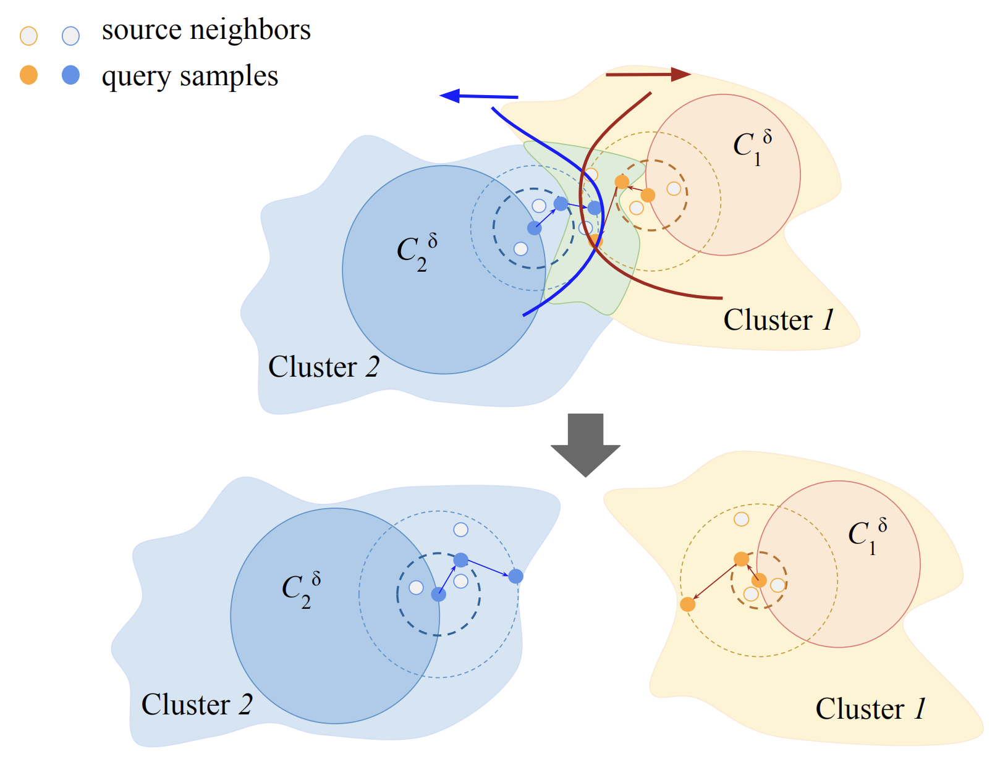

# SiLAN

Official Code for Source-informed Latent Augmented Neighborhood (SiLAN) [(Paper)](https://openreview.net/forum?id=iulMde3dP1)

# Introduction to SiLAN



In this work, we unveil that the domain shift causes significant dispersion in target features yet nearby points still tend to share similar labels, explaining the success of contrastive clustering in SFDA. Our theoretical analysis of contrastive SFDA reveals that three often-overlooked factors, associated with the aforementioned hypotheses, have significant implications for target classification performance. To address these three issues, we introduce SiLAN, a simple yet effective latent augmentation technique, ***SiLAN***, explicitly designed to improve contrastive SFDA.

# Prerequisites

Python 3.9, PyTorch>(1.8.0)

```
pip install -r requirements.txt
```

Create a data folder under the root, and put all the datasets into the data folder. 

```
mkdir data
```

Link to download the datasets:

[Office-31](https://openreview.net/forum?id=iulMde3dP1](https://faculty.cc.gatech.edu/~judy/domainadapt/))

[Office-Home](https://www.hemanthdv.org/officeHomeDataset.html)

[VisDA-2017](https://ai.bu.edu/visda-2017/)

# Usage

***Source Pretraining***

Office-31 and Office-Home

```
python source_pretrain_office.py
```

VisDA-2017
```
python source_pretrain_visda.py
```

***Target Adaptation***

Office-31 and Office-Home

```
python adaptation_office.py
```

VisDA-2017
```
python adaptation_visda.py
```


# References

If you find the code useful for your research, please consider citing

```
@article{wang2024silan,
  title={What Has Been Overlooked in Contrastive Source-Free Domain Adaptation: Leveraging Source-Informed Latent Augmentation within Neighborhood Context},
  author={Wang, Jing and Bae, Wonho and Chen, Jiahong and Zhang, Kuangen and Sigal, Leonid and de Silva, Clarence},
  journal={Transactions on Machine Learning Research},
  year={2024}
}
```

